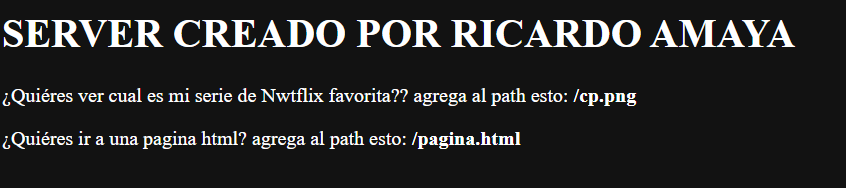

# Ricardo Amaya Rivera

# RETO 1

Escriba un servidor web que soporte múlltiples solicitudes seguidas (no concurrentes). El servidor debe retornar todos los archivos solicitados, incluyendo páginas html e imágenes. Construya un sitio web con javascript para probar su servidor. Despliegue su solución en Heroku. NO use frameworks web como Spark o Spring use solo Java y las librerías para manejo de la red.

# Funcionamiento: 

## Pagina pincial

## HTML

 

## PNG

## Heroku

https://arep-2021-2-taller2.herokuapp.com

## Construido con

* [Java] (https://www.oracle.com/technetwork/java/javase/downloads/jdk8-downloads-2133151.html)
* [Maven] (https://maven.apache.org/)

## Licencia

Este proyecto está licenciado bajo la Licencia MIT - vea el archivo [LICENSE.md] (LICENSE.md) para más detalles
